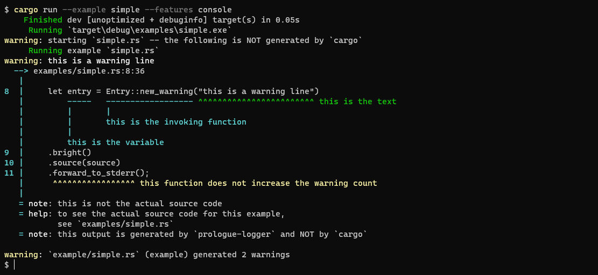
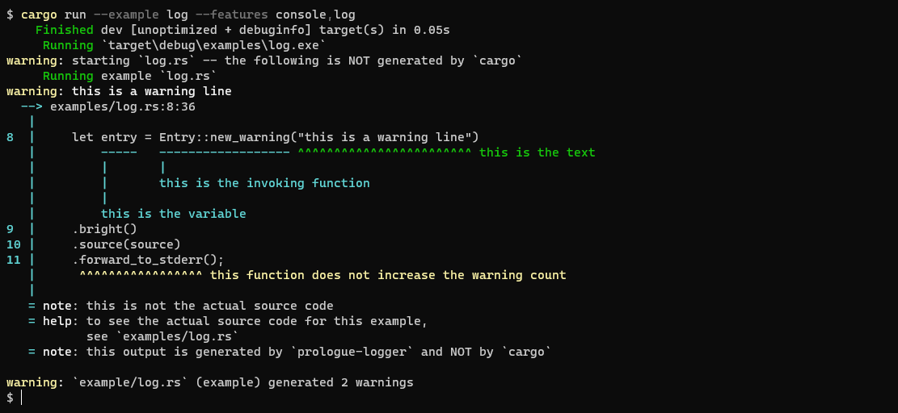

# Prologue Logger

A Rust library to produce Rust-like logs
for source code or settings files.

It offers many features, like:
* easy-to-use building patterns to customize the log entries;
* annotating source code lines with the Rust-like `^^^` underline;
* counting warnings and errors for multiple targets;
* colored output to `stderr` (requires the `console` feature);
* integration with the [`log`](https://docs.rs/log/latest/log/) API (requires the `log` feature);
* integration with the [`indicatif`](https://docs.rs/indicatif/latest/indicatif/) crate (requires the `indicatif` feature);
* color support with the [`console`](https://docs.rs/console/latest/console/) crate (requires the `console` feature).

## Usage

The simplest usage consists of creating a target to log to and then log entries to it.
```rust
use prologue_logger::{Target, Entry, Task};

fn main() -> prologue_logger::error::Result<()> {
    // Create a target.
    let target = Target::new("my-target");

    // Log some task to the above target.
    Task::new("Doing", "some work on `my-target`")
        .log_to_target(&target);
    // Log a more complex entry to the above target.
    Entry::new_warning("too lazy to work right now")
        // You can add a file reference...
        .named_source("my-target.example", 42, 13)
        // ... containing a source code line...
        .new_line(42, "    job.do_work()")
        // ... and then underline something on that line...
        .annotate_warn(13, 1, "help: add `.await` here")?
        // ... and add some other text to help with the warning.
        .help("add `.await` to make me do the work")
        // Finally, finish the construction of the source code line
        // and log it to the target.
        .finish()
        .log_to_target(&target);
    // Log some other task to the above target.
    Task::new("Finish", "job on `my-target`")
        .log_to_target(&target);
}
```

## Examples

[examples/simple.rs](examples/simple.rs)  
Features: `console`


[examples/log.rs](examples/log.rs)  
Features: `console`, `log`


[examples/file.rs](examples/file.rs)  
Features: `log`  
Contents of `file.log`:
```text
warning: starting `file.rs` -- the following is NOT generated by `cargo`
     Running example `file.rs`
warning: this is a warning line
  --> examples/file.rs:8:36
   |
8  |     let entry = Entry::new_warning("this is a warning line")
   |         -----   ------------------ ^^^^^^^^^^^^^^^^^^^^^^^^ this is the text
   |         |       |                 
   |         |       this is the invoking function
   |         |    
   |         this is the variable
9  |     .bright()
10 |     .source(source)
11 |     .forward_to_stderr();
   |      ^^^^^^^^^^^^^^^^^ this function does not increase the warning count
   |
   = note: this is not the actual source code
   = help: to see the actual source code for this example,
           see `examples/file.rs`
   = note: this output is generated by `prologue-logger` and NOT by `cargo`

```

[examples/indicatif.rs](examples/indicatif.rs)  
Features: `console`, `indicatif`, `log`


## License

<sup>
Although being part of a personal project, my work could still be useful to someone.
Therefore, this crate is licensed under either
<a href="LICENSE-APACHE">Apache License, Version 2.0</a> or
<a href="LICENSE-MIT">MIT license</a> at your option.
</sup>